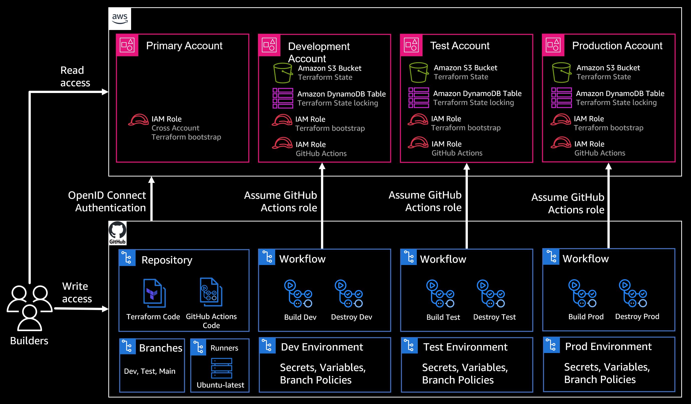
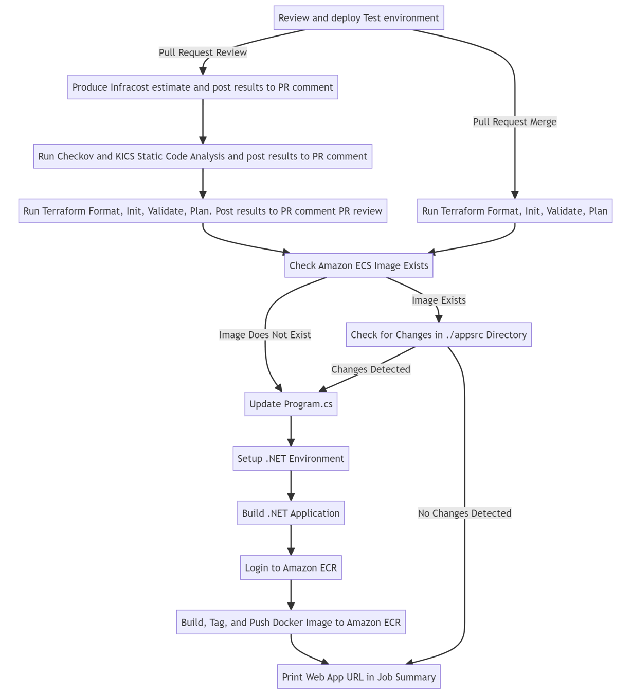
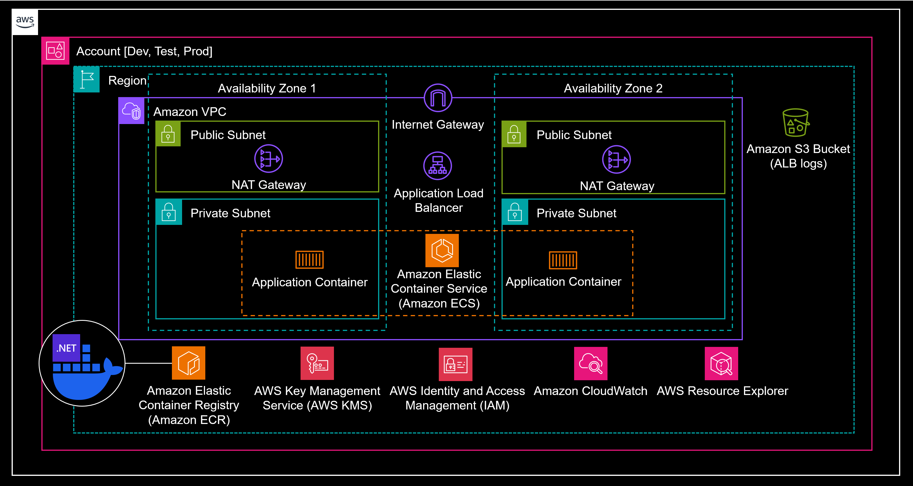

## How to use GitHub Actions and Terraform to deploy a Microsoft Web Application

This repository contains deployment templates used in the [How to use GitHub Actions and Terraform to deploy a Microsoft Web Application](https://aws.amazon.com/blogs/modernizing-with-aws/automate-microsoft-web-application-deployments-with-github-actions-and-terraform/) Amazon Web Services blog post.

Watch the [live demo](https://www.twitch.tv/videos/2241783900) for a quick tour.

## Design

### Pipeline Components
This code demonstrates how GitHub Actions and Terraform can automate the deployment of your AWS workloads across multiple environments.

### Workflow logic
The following GitHub action workflow logic will be deployed.

### Sample Workload
The sample workload runs in an Amazon VPC with a .NET Core web application hosted on Amazon ECS using AWS Fargate, spread across two Availability Zones, balanced by an ALB, with outbound communication via NAT Gateways, and external access through an Internet Gateway. It uses Amazon S3 for ALB logs, Amazon ECR for container images, AWS KMS for encryption, IAM for access management, CloudWatch for observability, and Resource Groups for efficient component management.

## How to use

Complete prerequisites section in [blog post](https://aws.amazon.com/blogs/modernizing-with-aws/automate-microsoft-web-application-deployments-with-github-actions-and-terraform/) and follow walkthrough.

## Security

See [CONTRIBUTING](CONTRIBUTING.md#security-issue-notifications) for more information.

## License

This library is licensed under the MIT-0 License. See the LICENSE file.